# js_syntax_error_browsers

<sub>
  Generated by <a href="https://github.com/jsenv/core/tree/main/packages/independent/snapshot">@jsenv/snapshot</a> executing <a href="../js_syntax_error_browsers.test.mjs">../js_syntax_error_browsers.test.mjs</a>
</sub>

## 0_chromium

```js
run({
  runtime: chromium(),
})
```

### 1/2 logs



<details>
  <summary>see without style</summary>

```console
⠋ start dev server
✔ start dev server (done in <X> second)

- http://localhost
- http://[::1]

Error while handling http://localhost/js_syntax_error.js:
PARSE_ERROR
base/client/js_syntax_error.js:1:11
1 | const a = (
              ^
```

</details>


### 2/2 reject

```console
SyntaxError: Unexpected end of input
```

## 1_firefox

```js
run({
  runtime: firefox({ disableOnWindowsBecauseFlaky: false }),
})
```

### 1/2 logs


<details>
  <summary>see without style</summary>

```console
⠋ start dev server
✔ start dev server (done in <X> second)

- http://localhost
- http://[::1]

Error while handling http://localhost/js_syntax_error.js:
PARSE_ERROR
base/client/js_syntax_error.js:1:11
1 | const a = (
              ^
```

</details>


### 2/2 reject

```console
SyntaxError: expected expression, got end of script
```

## 2_webkit

```js
run({
  runtime: webkit(),
})
```

### 1/2 logs


<details>
  <summary>see without style</summary>

```console
⠋ start dev server
✔ start dev server (done in <X> second)

- http://localhost
- http://[::1]

Error while handling http://localhost/js_syntax_error.js:
PARSE_ERROR
base/client/js_syntax_error.js:1:11
1 | const a = (
              ^
```

</details>


### 2/2 reject

```console
SyntaxError: Unexpected end of script
```