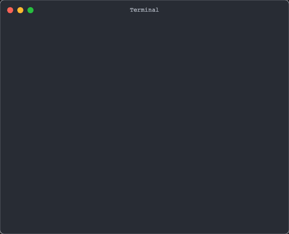

# Test execution terminal demos

This page contains animated GIF. Each GIF is a recording of the terminal while jsenv is executing files. There is various scenarios, like when file execution uses console.log or throw an error.

## browser

### console

### error in js module

## node

### console

### error in source function

