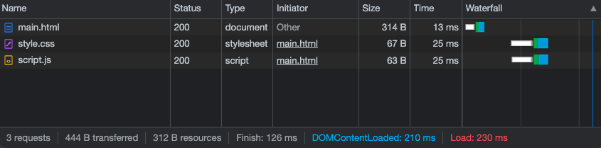

<!--
  - show 3 files (html, script.js, style.css)
  - show the dev server serving them
  - show screenshot of chrome network panel
  - show how to add pushResponse
  - show the result in chrome network panel
 -->

# Http2 push

This documentation shows how to use http2 push to improve network performances.

## Without push

### Network waterfall



### Server logs

```console
GET https://localhost:3679/main.html
200 OK
GET https://localhost:3679/script.js
200 OK
GET https://localhost:3679/style.css
200 OK
```

## With push

### Network waterfall


### Server logs

```console
GET https://localhost:3679/main.html
  Push /script.js
  200 OK
  Push /style.css
  200 OK
200 OK
```

## Demo source files

_main.html:_

```html
<!DOCTYPE html>
<html lang="en">
  <head>
    <title>Basic website</title>
    <link rel="icon" href="data:," />
  </head>

  <body>
    <link rel="stylesheet" href="./style.css" />
    <script type="module" src="./script.js"></script>
  </body>
</html>
```

_style.css:_

```css
body {
  background: orange;
}
```

_script.js:_

```js
console.log("Hello world")
```

_start_server.mjs:_

```js
import { requestCertificateForLocalhost } from "@jsenv/https-local"
import { startServer, fetchFileSystem } from "@jsenv/server"

const { certificate, privateKey } = requestCertificateForLocalhost()
await startServer({
  logLevel: "info",
  protocol: "https",
  port: 3679,
  http2: true,
  certificate,
  privateKey,
  services: [
    {
      handleRequest: (request) => {
        return fetchFileSystem(
          new URL(request.ressource.slice(1), import.meta.url),
          {
            headers: request.headers,
            canReadDirectory: true,
          },
        )
      },
    },
  ],
})
```

The following diff shows how http2 push can be added to the server:

```diff
import { requestCertificateForLocalhost } from "@jsenv/https-local"
import { startServer, fetchFileSystem } from "@jsenv/server"

const { certificate, privateKey } = requestCertificateForLocalhost()
await startServer({
  logLevel: "info",
  protocol: "https",
  port: 3679,
  http2: true,
  certificate,
  privateKey,
  services: [
    {
-     handleRequest: (request) => {
+     handleRequest: (request, { pushResponse }) => {
+       if (request.ressource === "/main.html") {
+       pushResponse({ path: "/script.js" })
+       pushResponse({ path: "/style.css" })
+     }
      return fetchFileSystem(
          new URL(request.ressource.slice(1), import.meta.url),
          {
            headers: request.headers,
            canReadDirectory: true,
          },
        )
      },
    },
  ],
})
```
