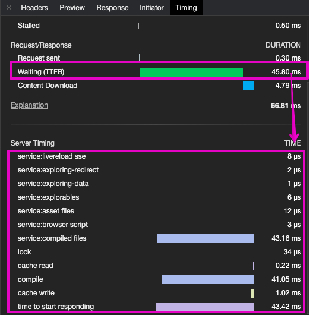

# Server timing

Server timing consists into sending headers in the response concerning the server performances. When looking at network panel in chrome devtools you can find a metric called TTFB (Time To First Byte). Without server timing you won't be able to know what your server was doing during that period. Read more in https://developer.mozilla.org/en-US/docs/Web/HTTP/Headers/Server-Timing

_Screenshot TTFB in chrome devtools:_

> Chrome devtools are saying TTFB took 45.80ms.


_Screenshot server timing in chrome devtools:_

> Server timing tells chrome devtools what server was doing during `45.80ms`: `43.16ms` were needed by something called `service:compiled files`.



## Measuring service timings

Use _serverTiming_ to measure time taken by each service.

```js
import { startServer, composeServices } from "@jsenv/server"

await startServer({
  serverTiming: true,
  services: [
    {
      name: "service:nocontent",
      handleRequest: (request) => {
        if (request.ressource !== "/") return null
        return { status: 204 }
      },
    },
    {
      name: "service:ok",
      handleRequest: (request) => {
        if (request.ressource !== "/whatever") return null
        return { status: 200 }
      },
    },
  ],
})
```

Code above generates a server timing response header that looks like this:

```console
server-timing: a;desc="service:nocontent.handleRequest";dur=0.007546901, b;desc="service:ok";dur=0.0018849
```

It is also possible to put more timing information by returning a _timing_ property as shown below:

```js
import { startServer, pluginServerTimings } from "@jsenv/server"

await startServer({
  serverTiming: true,
  services: [
    {
      handleRequest: async () => {
        const timeoutStart = performance.now()
        const [waitTiming] = await timeFunction("waiting 50ms", async () => {
          await new Promise((resolve) => {
            setTimeout(resolve, 50)
          })
        })
        const timeoutDuration = performance.now() - timeoutStart
        const additionStart = performance.now()
        1 + 1
        const additionDuration = performance.now() - additionStart
        return {
          status: 200,
          headers: {
            "content-type": "text/plain",
          },
          body: message,
          timing: {
            "setTimeout(50)": timeoutDuration,
            "1+1": additionDuration,
          },
        }
      },
    },
  ],
})
```

Code aboves generates a server timing response headers that looks as below

```console
server-timing: a;desc="setTimeout(50)";dur=50.7546901, b;desc="1+1";dur=0.0018849
```
