# assert

[](https://www.npmjs.com/package/@jsenv/assert)

A powerful assertion library focused on providing clear, informative, and visual feedback for JavaScript tests.

> equal() is my favorite assertion. If the only available assertion in every test suite was equal(), almost every test suite in the world would be better for it.
>
> — Eric Elliot in [Rethinking Unit Test Assertion](https://medium.com/javascript-scene/rethinking-unit-test-assertions-55f59358253f)

## Simple Yet Powerful

```js
import { assert } from "@jsenv/assert";

assert({
  actual: {
    foo: true,
  },
  expect: {
    foo: false,
  },
});
```


There is 200+ examples in [./tests/](./tests/readme.md)

## Features

### Color-Coded Diffs

Error messages use colors with specific meanings to make differences clear:

| Color  | Meaning                                       |
| ------ | --------------------------------------------- |
| grey   | same in actual and expect                     |
| red    | different from expect                         |
| green  | different from actual                         |
| yellow | exists only in actual / exists only in expect |

### JavaScript-Aware Comparisons

The library understands JavaScript types and provides meaningful differences:

```js
assert({
  actual: 149600000,
  expect: 1464301,
});
```



Special handling extends to URLs, dates, HTTP headers, and more.

### Beautiful Multiline String Diffs

```js
assert({
  actual: {
    foo: `Hello,
my name is Benjamin
and my brother is joe`,
  },
  expect: {
    foo: `Hello,
my name is Ben
and my brother is joe`,
  },
});
```


### Smart Formatting for Readability

Long diffs remain readable:

```js
assert({
  actual: "http://example_that_is_quite_long.com/dir/file.txt",
  expect: "http://example_that_is_quite_long.com/dir/file.css",
});
```


### Clear Nested Object Comparisons

For deeply nested objects, the message focuses on the important differences:

```js
assert({
  actual: {
    the: {
      nesting: {
        is: {
          very: {
            deep: {
              in: {
                this: {
                  one: {
                    foo: {
                      a: true,
                      tata: { test: true, bar: { a: "1" } },
                    },
                  },
                },
              },
            },
          },
        },
      },
    },
  },
  expect: {
    the: {
      nesting: {
        is: {
          very: {
            deep: {
              in: {
                this: {
                  one: {
                    foo: false,
                  },
                },
              },
            },
          },
        },
      },
    },
  },
});
```


### Custom assertions

```js
assert({
  actual: 50,
  expect: assert.between(100, 200),
});
```



### Advanced JavaScript Features

`@jsenv/assert` handles complex JavaScript concepts:

- Circular references
- Prototype differences [example](./tests/_prototype.test.js/prototype.test.js.md)
- Object integrity differences (`Object.freeze`, `Object.seal` and `Object.preventExtensions`) [example](./tests/_object_integrity.test.js/object_integrity.test.js.md)
- Property descriptor differences [example](./tests/_property_descriptor.test.js/property_descriptor.test.js.md)
- Symbol differences [example](./tests/_symbol.test.js/symbol.test.js.md)

## Installation

### Node.js

```console
npm i --save-dev @jsenv/assert
```

```js
import { assert } from "@jsenv/assert";

assert({
  actual: true,
  expect: false,
});
```

### Browser

#### Using NPM

```console
npm i --save-dev @jsenv/assert
```

```html
<script type="module">
  import { assert } from "@jsenv/assert";

  assert({
    actual: true,
    expect: false,
  });
</script>
```

#### Using CDN

```html
<script type="module">
  import { assert } from "https://unpkg.com/@jsenv/assert@latest";

  assert({
    actual: true,
    expect: false,
  });
</script>
```
