# [added on third pos](../../array.test.js)

```js
assert({
  actual: ["a", "b"],
  expect: ["a", "b", "Z"],
});
```



<details>
  <summary>see without style</summary>

```console
AssertionError: actual and expect are different

actual: [
  "a",
  "b",
]
expect: [
  "a",
  "b",
  "Z",
]
```

</details>


---

<sub>
  Generated by <a href="https://github.com/jsenv/core/tree/main/packages/tooling/snapshot">@jsenv/snapshot</a>
</sub>
