# [array like and array](../../array.test.js)

```js
assert({
  actual: {
    0: "Z",
    1: "b",
    length: 2,
  },
  expect: [
    "a", //
    "b",
  ],
});
```



<details>
  <summary>see without style</summary>

```console
AssertionError: actual and expect are different

actual: {
  0: "Z",
  1: "b",
  length: 2,
}
expect: [
  "a",
  "b",
]
```

</details>


---

<sub>
  Generated by <a href="https://github.com/jsenv/core/tree/main/packages/tooling/snapshot">@jsenv/snapshot</a>
</sub>
