# [associative array with values](../../array.test.js)

```js
assert({
  actual: Object.assign(["a", "b"], {
    user: "bob",
  }),
  expect: Object.assign(["Z", "b"], {
    user: "alice",
  }),
});
```



<details>
  <summary>see without style</summary>

```console
AssertionError: actual and expect are different

actual: [
  "a",
  "b",
] {
  user: "bob",
}
expect: [
  "Z",
  "b",
] {
  user: "alice",
}
```

</details>


---

<sub>
  Generated by <a href="https://github.com/jsenv/core/tree/main/packages/tooling/snapshot">@jsenv/snapshot</a>
</sub>
