# [diff on associate array deep property and object deep property](../../array.test.js)

```js
assert({
  actual: Object.assign([], {
    user: { name: "bob" },
  }),
  expect: {
    user: {
      name: "alice",
    },
  },
});
```



<details>
  <summary>see without style</summary>

```console
AssertionError: actual and expect are different

actual: [] {
  user: {
    name: "bob",
  },
}
expect: {
  user: {
    name: "alice",
  },
}
```

</details>


---

<sub>
  Generated by <a href="https://github.com/jsenv/core/tree/main/packages/tooling/snapshot">@jsenv/snapshot</a>
</sub>
