# [diff on collapsed array](../../array.test.js)

```js
assert({
  actual: {
    a: {
      same: [true],
      a: [false, false],
      r: [],
      ma: [false, true],
      mr: [false],
      m: [false, false],
    },
  },
  expect: {
    a: {
      same: [true],
      a: [],
      r: [true, true, true],
      ma: [true],
      mr: [true],
      m: [true, true],
    },
  },
  MAX_DIFF: 6,
  MAX_DIFF_PER_VALUE: 6,
  MAX_DEPTH_INSIDE_DIFF: 0,
});
```



<details>
  <summary>see without style</summary>

```console
AssertionError: actual and expect are different

actual: {
  a: {
    same: [true],
    a: [
      false,
      false,
    ],
    r: [],
    ma: [
      false,
      true,
    ],
    ↓ 2 props ↓
  },
}
expect: {
  a: {
    same: [true],
    a: [],
    r: [
      true,
      true,
      true,
    ],
    ma: [
      true,
    ],
    ↓ 2 props ↓
  },
}
```

</details>


---

<sub>
  Generated by <a href="https://github.com/jsenv/core/tree/main/packages/tooling/snapshot">@jsenv/snapshot</a>
</sub>
