# [buffer.from vs Uint8Array.from](../../array_typed.test.js)

```js
assert({
  actual: Buffer.from("a"),
  expect: Uint8Array.from([0x61]),
});
```



<details>
  <summary>see without style</summary>

```console
AssertionError: actual and expect are different

actual: Buffer [97]
expect: Uint8Array [97]
```

</details>


---

<sub>
  Generated by <a href="https://github.com/jsenv/core/tree/main/packages/tooling/snapshot">@jsenv/snapshot</a>
</sub>
