# [same length buffer diff at start](../../array_typed.test.js)

```js
assert({
  actual: Buffer.from("hello, my name is dam"),
  expect: Buffer.from("Zello, my name is dam"),
});
```



<details>
  <summary>see without style</summary>

```console
AssertionError: actual and expect are different

actual: Buffer [
  104,
  101,
  ↓ 19 values ↓
]
expect: Buffer [
  90,
  101,
  ↓ 19 values ↓
]
```

</details>


---

<sub>
  Generated by <a href="https://github.com/jsenv/core/tree/main/packages/tooling/snapshot">@jsenv/snapshot</a>
</sub>
