# [Uint8Array vs Array](../../array_typed.test.js#L77)

```js
assert({
  actual: Uint8Array,
  expect: Array,
});
```



<details>
  <summary>see without style</summary>

```console
AssertionError: actual and expect are different

actual: Uint8Array
expect: Array
```

</details>


---

<sub>
  Generated by <a href="https://github.com/jsenv/core/tree/main/packages/independent/snapshot">@jsenv/snapshot</a>
</sub>
