# [0.3 and 0.4](../../assert_close_to.test.js)

```js
assert({
  actual: 0.1 + 0.2,
  expect: assert.closeTo(0.4),
});
```



<details>
  <summary>see without style</summary>

```console
AssertionError: actual and expect are different

actual: 0.30_000_000_000_000_004
expect: assert.closeTo(0.4)
```

</details>


---

<sub>
  Generated by <a href="https://github.com/jsenv/core/tree/main/packages/tooling/snapshot">@jsenv/snapshot</a>
</sub>
