# [inside second array not matching](../../assert_matches.test.js)

```js
assert({
  actual: ["before", "expired A seconds ago", "after"],
  expect: ["before", assert.matches(/expired \d seconds ago/), "after"],
});
```



<details>
  <summary>see without style</summary>

```console
AssertionError: actual and expect are different

actual: [
  "before",
  "expired A seconds ago",
  "after",
]
expect: [
  "before",
  assert.matches(/expired \d seconds ago/),
  "after",
]
```

</details>


---

<sub>
  Generated by <a href="https://github.com/jsenv/core/tree/main/packages/tooling/snapshot">@jsenv/snapshot</a>
</sub>
