# [object and not(object)](../../assert_not.test.js)

```js
assert({
  actual: {
    a: true,
    b: { b2: true },
  },
  expect: {
    a: false,
    b: assert.not({ b2: false }),
  },
});
```



<details>
  <summary>see without style</summary>

```console
AssertionError: actual and expect are different

actual: {
  a: true,
  b: {
    b2: true,
  },
}
expect: {
  a: false,
  b: assert.not({
    b2: false,
  }),
}
```

</details>


---

<sub>
  Generated by <a href="https://github.com/jsenv/core/tree/main/packages/tooling/snapshot">@jsenv/snapshot</a>
</sub>
