# [no diff](../../assert_starts_with.test.js)

```js
assert({
  actual: {
    a: "AABB",
    b: true,
  },
  expect: {
    a: assert.startsWith("AAB"),
    b: false,
  },
});
```



<details>
  <summary>see without style</summary>

```console
AssertionError: actual and expect are different

actual: {
  a: "AABB",
  b: true,
}
expect: {
  a: assert.startsWith("AAB"),
  b: false,
}
```

</details>


---

<sub>
  Generated by <a href="https://github.com/jsenv/core/tree/main/packages/tooling/snapshot">@jsenv/snapshot</a>
</sub>
