# [true should be 1](../../boolean.test.js)

```js
assert({
  actual: true,
  expect: 1,
});
```



<details>
  <summary>see without style</summary>

```console
AssertionError: actual and expect are different

actual: true
expect: 1
```

</details>


---

<sub>
  Generated by <a href="https://github.com/jsenv/core/tree/main/packages/tooling/snapshot">@jsenv/snapshot</a>
</sub>
