# [GMT+5 vs Z](../../date.test.js)

```js
assert({
  actual: "Thu Jan 01 1970 12:00:00 GMT+0500",
  expect: "1970-01-01 00:00:00.000Z",
});
```



<details>
  <summary>see without style</summary>

```console
AssertionError: actual and expect are different

actual: "1970-01-01 07:00:00Z"
expect: "1970-01-01 00:00:00Z"
```

</details>


---

<sub>
  Generated by <a href="https://github.com/jsenv/core/tree/main/packages/tooling/snapshot">@jsenv/snapshot</a>
</sub>
