# [millisecond only diff on iso](../../date.test.js)

```js
assert({
  actual: "1970-01-01 00:00:00.000Z",
  expect: "1970-01-01 00:00:00.020Z",
});
```



<details>
  <summary>see without style</summary>

```console
AssertionError: actual and expect are different

actual: "1970-01-01 00:00:00.000Z"
expect: "1970-01-01 00:00:00.020Z"
```

</details>


---

<sub>
  Generated by <a href="https://github.com/jsenv/core/tree/main/packages/tooling/snapshot">@jsenv/snapshot</a>
</sub>
