# [error stack vs object with stack](../../error.test.js)

```js
assert({
  actual: new Error("message"),
  expect: { stack: "stack" },
});
```



<details>
  <summary>see without style</summary>

```console
AssertionError: actual and expect are different

actual: Error: message
expect: {
  stack: "stack",
}
```

</details>


---

<sub>
  Generated by <a href="https://github.com/jsenv/core/tree/main/packages/tooling/snapshot">@jsenv/snapshot</a>
</sub>
