# [redirected response](../../fetch.test.js)

```js
assert({
  actual: new Response("", { status: 200 }),
  expect: Response.redirect("http://example.com"),
});
```



<details>
  <summary>see without style</summary>

```console
AssertionError: actual and expect are different

actual: Response(ReadableStream, {
  headers: Headers(
    "content-type" => "text/plain;charset=UTF-8",
  ),
  status: 200,
})
expect: Response(null, {
  headers: Headers(
    "location" => "http://example.com/",
  ),
  status: 302,
})
```

</details>


---

<sub>
  Generated by <a href="https://github.com/jsenv/core/tree/main/packages/tooling/snapshot">@jsenv/snapshot</a>
</sub>
