# [request abort signal pending vs aborted](../../fetch.test.js)

```js
const expectAbortController = new AbortController();
expectAbortController.abort("toto");
assert({
  actual: new Request("http://example.com", {
    signal: new AbortController().signal,
  }),
  expect: new Request("http://example.com", {
    signal: expectAbortController.signal,
  }),
});
```



<details>
  <summary>see without style</summary>

```console
AssertionError: actual and expect are different

actual: Request("http://example.com/")
expect: Request("http://example.com/", {
  signal: AbortSignal {
    aborted: true,
    reason: "toto",
  },
})
```

</details>


---

<sub>
  Generated by <a href="https://github.com/jsenv/core/tree/main/packages/tooling/snapshot">@jsenv/snapshot</a>
</sub>
