# [response prop diff](../../fetch.test.js)

```js
assert({
  actual: new Response("", {
    status: 200,
    statusText: "",
    type: "basic",
  }),
  expect: new Response("", {
    status: 400,
    statusText: "Bad request",
    headers: {
      "content-length": "0",
    },
    type: "opaque",
  }),
  MAX_CONTEXT_BEFORE_DIFF: 8,
  MAX_CONTEXT_AFTER_DIFF: 8,
});
```



<details>
  <summary>see without style</summary>

```console
AssertionError: actual and expect are different

actual: Response(ReadableStream, {
  headers: Headers(
    "content-type" => "text/plain;charset=UTF-8",
  ),
  status: 200,
})
expect: Response(ReadableStream, {
  headers: Headers(
    "content-length" => "0"
  ),
  status: 400,
  statusText: "Bad request",
})
```

</details>


---

<sub>
  Generated by <a href="https://github.com/jsenv/core/tree/main/packages/tooling/snapshot">@jsenv/snapshot</a>
</sub>
