# [response status diff](../../fetch.test.js)

```js
assert({
  actual: new Response("", {
    status: 200,
  }),
  expect: new Response("", {
    status: 400,
  }),
});
```



<details>
  <summary>see without style</summary>

```console
AssertionError: actual and expect are different

actual: Response(ReadableStream, {
  status: 200,
})
expect: Response(ReadableStream, {
  status: 400,
})
```

</details>


---

<sub>
  Generated by <a href="https://github.com/jsenv/core/tree/main/packages/tooling/snapshot">@jsenv/snapshot</a>
</sub>
