# [arrow function source modified, name same](../../function.test.js)

```js
const anonymousArrowReturningTrue = (function () {
  return () => true;
})();
const anonymousArrowReturningFalse = (function () {
  return () => false;
})();
assert({
  actual: anonymousArrowReturningTrue,
  expect: anonymousArrowReturningFalse,
});
```



<details>
  <summary>see without style</summary>

```console
AssertionError: actual and expect are different

actual: () => {
  [source code],
}
expect: () => {
  [source code],
}
```

</details>


---

<sub>
  Generated by <a href="https://github.com/jsenv/core/tree/main/packages/tooling/snapshot">@jsenv/snapshot</a>
</sub>
