# [async function vs function](../../function.test.js)

```js
const anonymousAsyncFunction = (function () {
  return async function () {};
})();
const anonymousFunction = (function () {
  return function () {};
})();
assert({
  actual: anonymousAsyncFunction,
  expect: anonymousFunction,
});
```



<details>
  <summary>see without style</summary>

```console
AssertionError: actual and expect are different

actual: async function () { [source code] }
expect: function () { [source code] }
```

</details>


---

<sub>
  Generated by <a href="https://github.com/jsenv/core/tree/main/packages/tooling/snapshot">@jsenv/snapshot</a>
</sub>
