# [class Animal vs class Robot](../../function.test.js)

```js
assert({
  actual: class Animal {},
  expect: class Robot {},
});
```



<details>
  <summary>see without style</summary>

```console
AssertionError: actual and expect are different

actual: class Animal { [source code] }
expect: class Robot { [source code] }
```

</details>


---

<sub>
  Generated by <a href="https://github.com/jsenv/core/tree/main/packages/tooling/snapshot">@jsenv/snapshot</a>
</sub>
