# [class constructor added](../../function.test.js#L279)

```js
assert({
  actual: class {
    constructor() {
      console.log("actual");
    }
  },
  expect: class {},
});
```



<details>
  <summary>see without style</summary>

```console
AssertionError: actual and expect are different

actual: class actual {
  [source code];
}
expect: class expect {
  [source code];
}
```

</details>


---

<sub>
  Generated by <a href="https://github.com/jsenv/core/tree/main/packages/independent/snapshot">@jsenv/snapshot</a>
</sub>
