# [class method added](../../function.test.js)

```js
assert({
  actual: class A {
    a() {}
  },
  expect: class A {},
});
```



<details>
  <summary>see without style</summary>

```console
AssertionError: actual and expect are different

actual: class A {
  [source code];
  a() {
    [source code],
  };
}
expect: class A {
  [source code];
}
```

</details>


---

<sub>
  Generated by <a href="https://github.com/jsenv/core/tree/main/packages/tooling/snapshot">@jsenv/snapshot</a>
</sub>
