# [class prototype method vs function prototype method](../../function.test.js)

```js
const toto = function () {};
toto.a = true;
toto.prototype.b = () => {};
assert({
  actual: class {
    static a = true;
    b() {}
  },
  expect: toto,
});
```



<details>
  <summary>see without style</summary>

```console
AssertionError: actual and expect are different

actual: class actual {
  [source code];
  b() {
    [source code],
  };
  static a = true;
}
expect: function toto () {
  [source code],
  prototype: {
    b: () => {
      [source code],
    },
  },
  a: true,
}
```

</details>


---

<sub>
  Generated by <a href="https://github.com/jsenv/core/tree/main/packages/tooling/snapshot">@jsenv/snapshot</a>
</sub>
