# [class static prop and function prop](../../function.test.js)

```js
assert({
  actual: class {
    static a = true;
  },
  expect: Object.assign(function () {}, {
    a: true,
  }),
});
```



<details>
  <summary>see without style</summary>

```console
AssertionError: actual and expect are different

actual: class actual {
  [source code];
  static a = true;
}
expect: function () {
  [source code],
  a: true,
}
```

</details>


---

<sub>
  Generated by <a href="https://github.com/jsenv/core/tree/main/packages/tooling/snapshot">@jsenv/snapshot</a>
</sub>
