# [class static property and object property](../../function.test.js)

```js
assert({
  actual: class {
    static a = true;
    static b = true;
  },
  expect: {
    a: true,
    b: false,
  },
});
```



<details>
  <summary>see without style</summary>

```console
AssertionError: actual and expect are different

actual: class actual {
  [source code];
  static a = true;
  static b = true;
}
expect: {
  a: true,
  b: false,
}
```

</details>


---

<sub>
  Generated by <a href="https://github.com/jsenv/core/tree/main/packages/tooling/snapshot">@jsenv/snapshot</a>
</sub>
