# [extends Animal vs extend Robot](../../function.test.js)

```js
class Animal {
  static type = "animal";
}
class Robot {
  static type = "robot";
}
assert({
  actual: class Human extends Animal {
    static type = "human_actual";
  },
  expect: class Human extends Robot {
    static type = "human_expected";
  },
});
```



<details>
  <summary>see without style</summary>

```console
AssertionError: actual and expect are different

actual: class Human extends Animal {
  [source code];
  static type = "human_actual";
}
expect: class Human extends Robot {
  [source code];
  static type = "human_expected";
}
```

</details>


---

<sub>
  Generated by <a href="https://github.com/jsenv/core/tree/main/packages/tooling/snapshot">@jsenv/snapshot</a>
</sub>
