# [number of diff when comparing async function and function](../../function.test.js)

```js
const anonymousAsyncFunction = (function () {
  return async function () {};
})();
const anonymousFunction = (function () {
  return function () {};
})();
assert({
  actual: {
    a: anonymousAsyncFunction,
    b: true,
  },
  expect: {
    a: anonymousFunction,
    b: false,
  },
});
```



<details>
  <summary>see without style</summary>

```console
AssertionError: actual and expect are different

actual: {
  a: async function () { [source code] },
  b: true,
}
expect: {
  a: function () { [source code] },
  b: false,
}
```

</details>


---

<sub>
  Generated by <a href="https://github.com/jsenv/core/tree/main/packages/tooling/snapshot">@jsenv/snapshot</a>
</sub>
