# [static method return value modified](../../function.test.js)

```js
const anonymousActualClass = (function () {
  return class {
    static a() {
      return true;
    }
  };
})();
const anonymousExpectClass = (function () {
  return class {
    static a() {
      return false;
    }
  };
})();
assert({
  actual: anonymousActualClass,
  expect: anonymousExpectClass,
});
```



<details>
  <summary>see without style</summary>

```console
AssertionError: actual and expect are different

actual: class {
  [source code];
  a() {
    [source code],
  };
}
expect: class {
  [source code];
  a() {
    [source code],
  };
}
```

</details>


---

<sub>
  Generated by <a href="https://github.com/jsenv/core/tree/main/packages/tooling/snapshot">@jsenv/snapshot</a>
</sub>
