# [static property value modified](../../function.test.js)

```js
const anonymousActualClass = (function () {
  return class {
    a = "a_prop"; // class properties cannot be listed so it won't be catched
    static a = "a_static";
  };
})();
const anonymousExpectClass = (function () {
  return class {
    a = "a_prop_2";
    static a = "a_static_2";
  };
})();
assert({
  actual: anonymousActualClass,
  expect: anonymousExpectClass,
});
```



<details>
  <summary>see without style</summary>

```console
AssertionError: actual and expect are different

actual: class {
  [source code];
  static a = "a_static";
}
expect: class {
  [source code];
  static a = "a_static_2";
}
```

</details>


---

<sub>
  Generated by <a href="https://github.com/jsenv/core/tree/main/packages/tooling/snapshot">@jsenv/snapshot</a>
</sub>
