# [accept-language](../../headers.test.js)

```js
assert({
  actual: new Headers({
    "accept-language": "fr-CH, fr;q=0.9, en;q=0.8, de;q=0.7, *;q=0.5",
  }),
  expect: new Headers({
    "accept-language": "en-US,en;q=0.5",
  }),
});
```



<details>
  <summary>see without style</summary>

```console
AssertionError: actual and expect are different

actual: Headers(
  "accept-language" => "fr-CH, fr;q=0.9, en;q=0.8, de;q=0.7, *;q=0.5"
)
expect: Headers(
  "accept-language" => "en-US,en;q=0.5"
)
```

</details>


---

<sub>
  Generated by <a href="https://github.com/jsenv/core/tree/main/packages/tooling/snapshot">@jsenv/snapshot</a>
</sub>
