# [content length diff](../../headers.test.js)

```js
assert({
  actual: new Headers({
    "content-length": "1456",
  }),
  expect: new Headers({
    "content-length": "1356",
  }),
});
```



<details>
  <summary>see without style</summary>

```console
AssertionError: actual and expect are different

actual: Headers(
  "content-length" => "1456"
)
expect: Headers(
  "content-length" => "1356"
)
```

</details>


---

<sub>
  Generated by <a href="https://github.com/jsenv/core/tree/main/packages/tooling/snapshot">@jsenv/snapshot</a>
</sub>
