# [remove metric in server timing](../../headers.test.js)

```js
assert({
  actual: new Headers({
    "server-timing": `cpu;dur=2.4`,
  }),
  expect: new Headers({
    "server-timing": `cpu;dur=2.4, app;dur=47.2`,
  }),
});
```



<details>
  <summary>see without style</summary>

```console
AssertionError: actual and expect are different

actual: Headers(
  "server-timing" => "cpu;dur=2.4"
)
expect: Headers(
  "server-timing" => "cpu;dur=2.4, app;dur=47.2"
)
```

</details>


---

<sub>
  Generated by <a href="https://github.com/jsenv/core/tree/main/packages/tooling/snapshot">@jsenv/snapshot</a>
</sub>
