# [url search param modified, middle of long params](../../max_columns.test.js)

```js
assert({
  actual: "http://example_that_is_long.com?this_is_relatively_long=1&foo=a",
  expect: "http://example_that_is_long.com?this_is_relatively_long=1&foo=b",
  MAX_COLUMNS: 30,
});
```



<details>
  <summary>see without style</summary>

```console
AssertionError: actual and expect are different

actual: "…?this_is_rel…&foo=a"
expect: "…?this_is_rel…&foo=b"
```

</details>


---

<sub>
  Generated by <a href="https://github.com/jsenv/core/tree/main/packages/tooling/snapshot">@jsenv/snapshot</a>
</sub>
