# [array in property at 26](../../max_columns.test.js)

```js
// expecting to go through the following phases
// but not as soon as columns+1 as some steps require 2 more chars to be displayed
// 1. "abcdefghijklmno,"
// 2. "abcdefghijklmno: …,"
// 3. "abcdefghijklmno: […],"
// 4. "abcdefghijklmno: [0, …],"
assert({
  actual: {
    abcdefghijklmno: [0, 1, 2],
    z: true,
  },
  expect: {
    abcdefghijklmno: [0, 1, 2],
    z: false,
  },
  MAX_COLUMNS,
});
```



<details>
  <summary>see without style</summary>

```console
AssertionError: actual and expect are different

actual: {
  abcdefghijklmno: [0, …],
  z: true,
}
expect: {
  abcdefghijklmno: [0, …],
  z: false,
}
```

</details>


---

<sub>
  Generated by <a href="https://github.com/jsenv/core/tree/main/packages/tooling/snapshot">@jsenv/snapshot</a>
</sub>
