# [at added char 3](../../max_columns.test.js)

```js
assert({
  actual: "a_long_string_123456789",
  expect: "a_long_string",
  MAX_COLUMNS: 22,
});
```



<details>
  <summary>see without style</summary>

```console
AssertionError: actual and expect are different

actual: …"ng_string_"…
expect: …"ng_string"
```

</details>


---

<sub>
  Generated by <a href="https://github.com/jsenv/core/tree/main/packages/tooling/snapshot">@jsenv/snapshot</a>
</sub>
