# [boolean in property at 10](../../max_columns.test.js)

```js
assert({
  actual: {
    abcdefgh: true,
  },
  expect: {
    abcdefgh: false,
  },
  MAX_COLUMNS,
});
```



<details>
  <summary>see without style</summary>

```console
AssertionError: actual and expect are different

actual: {
  abcdef…,
}
expect: {
  abcdef…,
}
```

</details>


---

<sub>
  Generated by <a href="https://github.com/jsenv/core/tree/main/packages/tooling/snapshot">@jsenv/snapshot</a>
</sub>
