# [double slash and truncate line](../../max_columns.test.js)

```js
assert({
  actual: `file:///dmail/documents/dev/jsenv-core/node_modules/@jsenv/assert/src/internal/something.js`,
  expect: `file:///dmail/documents/dev/jsenv-core/node_modules/@jsenv/assert/src/internal//something.js`,
  MAX_COLUMNS: 50,
});
```



<details>
  <summary>see without style</summary>

```console
AssertionError: actual and expect are different

actual: "…e_modules/@jsenv/assert/src/internal/s…"
expect: "…e_modules/@jsenv/assert/src/internal//…"
```

</details>


---

<sub>
  Generated by <a href="https://github.com/jsenv/core/tree/main/packages/tooling/snapshot">@jsenv/snapshot</a>
</sub>
