# [lines around end is truncated](../../max_columns.test.js)

```js
assert({
  actual: `
123456789
abcdef
1234567`,
  expect: `
123456789
Zbcdef
123456789`,
  MAX_COLUMNS: 15,
});
```



<details>
  <summary>see without style</summary>

```console
AssertionError: actual and expect are different

actual: 1| 
        2| 123…
        3| abc…
        4| 123…
expect: 1| 
        2| 123…
        3| Zbc…
        4| 123…
```

</details>


---

<sub>
  Generated by <a href="https://github.com/jsenv/core/tree/main/packages/tooling/snapshot">@jsenv/snapshot</a>
</sub>
