# [lines around start partially truncated](../../max_columns.test.js)

```js
assert({
  actual: `
123456789
abcdefghijkl`,
  expect: `
123456789
abcdefghZjkl`,
  MAX_COLUMNS: 16,
});
```



<details>
  <summary>see without style</summary>

```console
AssertionError: actual and expect are different

actual: 1| 
        2| …789
        3| …ghi…
expect: 1| 
        2| …789
        3| …ghZ…
```

</details>


---

<sub>
  Generated by <a href="https://github.com/jsenv/core/tree/main/packages/tooling/snapshot">@jsenv/snapshot</a>
</sub>
