# [long url diff in the middle](../../max_columns.test.js)

```js
assert({
  actual: "http://example_that_is_quite_long.com/dir/file.txt",
  expect: "http://example_that_AA_quite_long.com/dir/file.txt",
  MAX_COLUMNS: 40,
});
```



<details>
  <summary>see without style</summary>

```console
AssertionError: actual and expect are different

actual: "…example_that_is_quite_long.c…"
expect: "…example_that_aa_quite_long.c…"
```

</details>


---

<sub>
  Generated by <a href="https://github.com/jsenv/core/tree/main/packages/tooling/snapshot">@jsenv/snapshot</a>
</sub>
