# [on property at 15 and value width is 1](../../max_columns.test.js)

```js
assert({
  actual: {
    abcdefgh: 0,
  },
  expect: {
    abcdefgh: 1,
  },
  MAX_COLUMNS: 14,
});
```



<details>
  <summary>see without style</summary>

```console
AssertionError: actual and expect are different

actual: {
  abcdefgh: 0,
}
expect: {
  abcdefgh: 1,
}
```

</details>


---

<sub>
  Generated by <a href="https://github.com/jsenv/core/tree/main/packages/tooling/snapshot">@jsenv/snapshot</a>
</sub>
