# [-1.23456e15 and -1200000e5](../../number.test.js)

```js
assert({
  actual: -1.23456e15,
  expect: -1200000e5,
});
```



<details>
  <summary>see without style</summary>

```console
AssertionError: actual and expect are different

actual: -1_234_560_000_000_000
expect:       -120_000_000_000
```

</details>


---

<sub>
  Generated by <a href="https://github.com/jsenv/core/tree/main/packages/tooling/snapshot">@jsenv/snapshot</a>
</sub>
